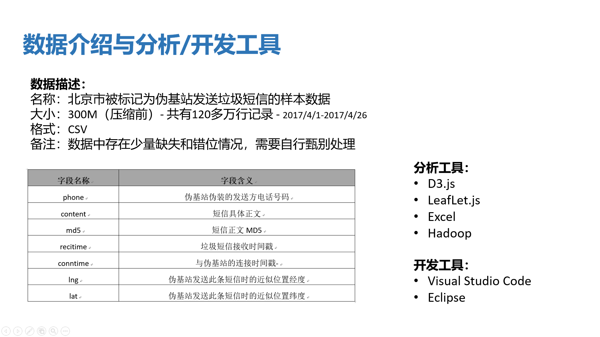
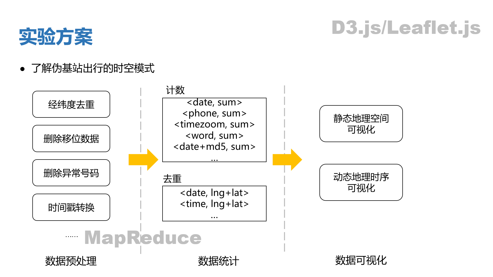
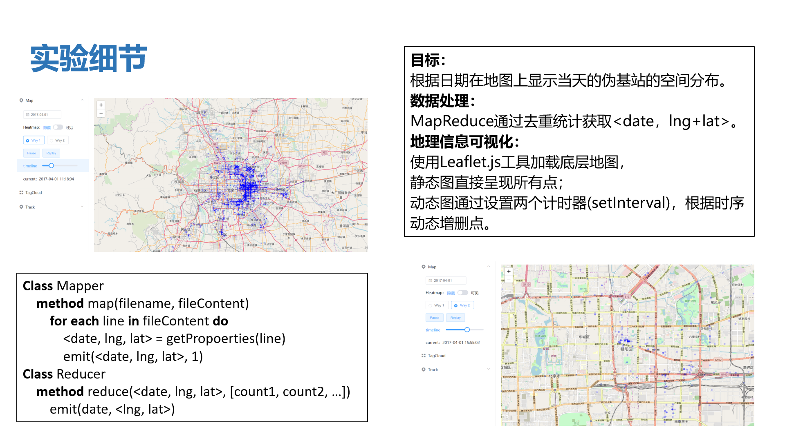
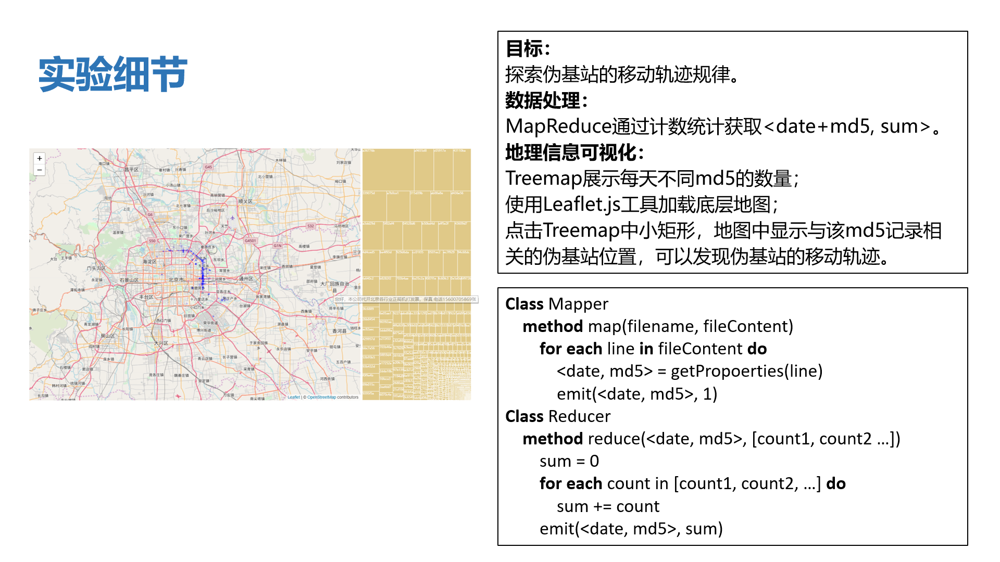
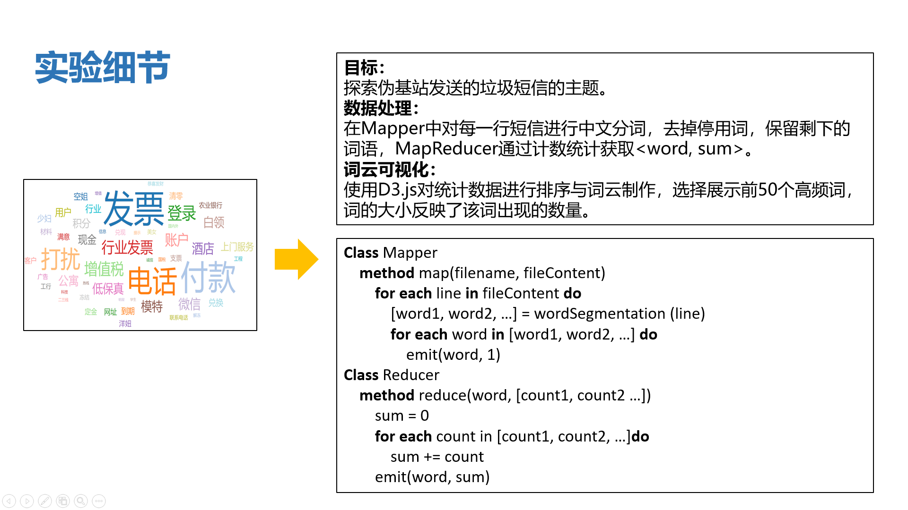
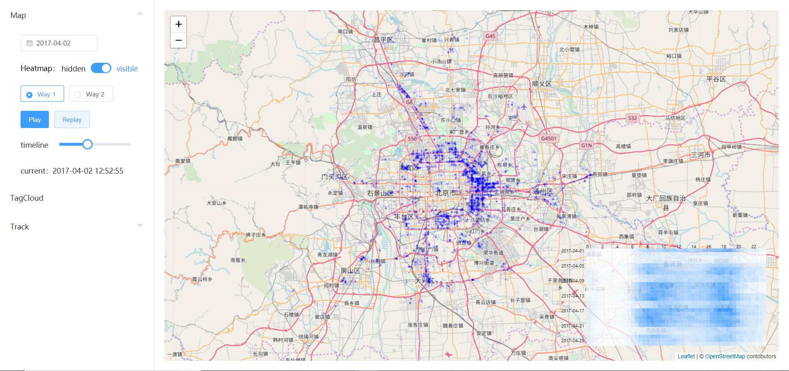
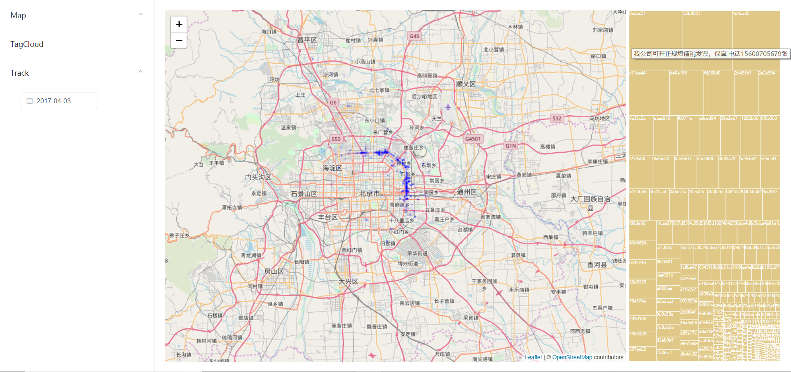

# 伪基站地理数据可视化与可视分析

**大数据处理**课程实验，选题为**伪基站地理数据可视化与可视分析**，针对ChinaVis2017伪基站数据进行可视分析，探索伪基站的时空分布规律和移动轨迹。实验具体可分为两部分：首先通过Hadoop的MapReduce对原始数据进行去重、计数等简单统计；然后采用可视化对统计结果进行展示。

本项目中只包括前端可视化部分的代码，没有放Hadoop MapReduce的代码。

数据背景详细介绍：[http://chinavis.org/2017/challenge.html](http://chinavis.org/2017/challenge.html)

---

## 实验详情








---

## 项目展示
手动实现了时序数据的地理可视化，即随着时间推进，对点(经纬度表示点位置)进行动态增删。

实现了两种动态演化方式：(1)随着时间推进，增加点；(2)随着时间推进，增加新的点，删除旧的点。两种方式都借助setInterval实现。

通过Timeline对时间轴进行控制，实时更新地理视图。

### 伪基站时空分布规律探索


### 伪基站移动轨迹探索 


### 项目演示


---

## 依赖
[vue](https://cn.vuejs.org/v2/guide/)

[vue-router](https://router.vuejs.org/zh/guide/#html)

[axios](https://www.kancloud.cn/yunye/axios/234845)

[element-ui](http://element-cn.eleme.io/#/zh-CN)：一套基于Vue 2.0的桌面端组件库

[d3](https://d3js.org/)：一个受欢迎的可视化工具

[d3.layout.cloud](https://www.npmjs.com/package/d3.layout.cloud)：词云

[leaflet](https://leafletjs.com/)：地理可视化

---

## Project setup
```
npm install
```

### Compiles and hot-reloads for development
```
npm run serve
```

### Compiles and minifies for production
```
npm run build
```

### Run your tests
```
npm run test
```

### Lints and fixes files
```
npm run lint
```

### Customize configuration
See [Configuration Reference](https://cli.vuejs.org/config/).
